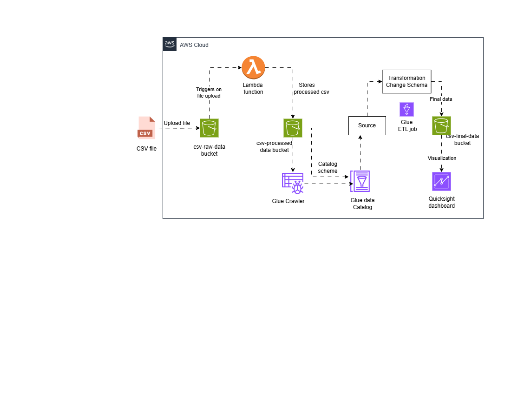

# 📊 AWS Serverless Data Pipeline

This project implements a fully serverless data pipeline using AWS services. It automates the ingestion, cleaning, transformation, and visualization of CSV data in near real-time.

---

## ☁️ Architecture Overview

The pipeline consists of the following stages:

1. **CSV Ingestion** – Raw data is uploaded to `csv-raw-data` S3 bucket.
2. **Lambda Preprocessing** – AWS Lambda is triggered by the upload event, cleans the data, and stores it in `csv-processed-data`.
3. **Glue ETL** – AWS Glue transforms and prepares data, storing the result in `csv-final-data`.
4. **QuickSight Dashboard** – Amazon QuickSight connects to final data for visualization.

---

## 🛠️ Services Used

| AWS Service       | Role                                                                 |
|-------------------|----------------------------------------------------------------------|
| **Amazon S3**      | Raw → Processed → Final data storage                                 |
| **AWS Lambda**     | Cleans uploaded CSV files automatically                              |
| **AWS Glue**       | Performs ETL and schema transformation                               |
| **Amazon QuickSight** | Creates dashboards and visualizes trends                        |
| **IAM**            | Secure roles and policies for access management                      |

---

## 📄 Project Report

📥 [Download Full Project Report](data-pipeline.pdf)

---

## 📝 License

This project is licensed under the [MIT License](LICENSE).  
Feel free to use, modify, and share — with attribution.

